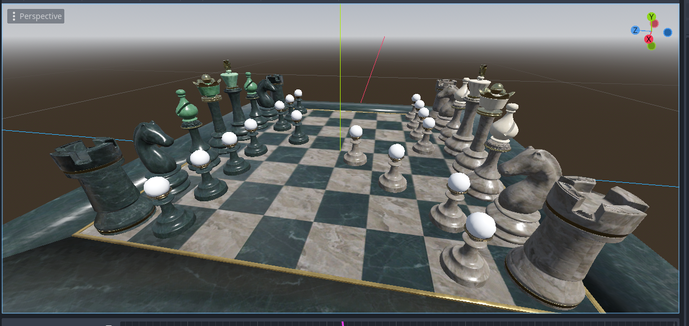

A Work-In-Progress Python MaterialX to Godot VisualShader converter

## Requirements

- `godot_parser`
- `MaterialX`

## Using

`python mtlx-to-godot.py <material.mtlx>`

_Chess set from https://github.com/AcademySoftwareFoundation/MaterialX#open-chess-set_
